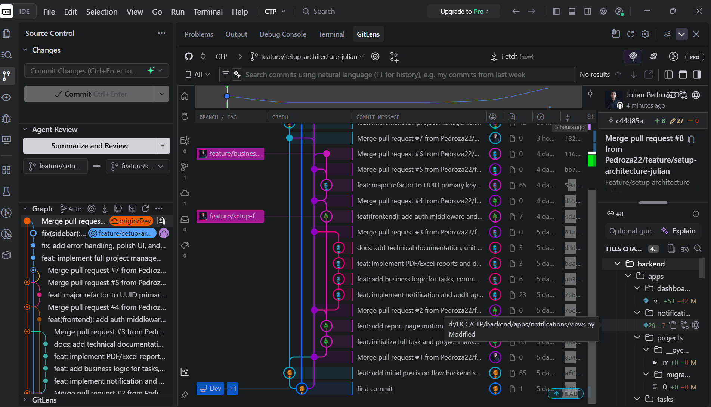

# Precision Flow - Sistema de Gestión de Proyectos

Aplicación web colaborativa para la gestión de proyectos y tareas, diseñada para equipos de desarrollo.

## Credenciales de Prueba

Para facilitar las pruebas de la plataforma, se han creado los siguientes usuarios:

### Administrador
- **Email:** `admin@example.com`
- **Contraseña:** `admin123`
- **Rol:** Admin (Acceso total a estadísticas y gestión de usuarios)

### Desarrolladores (Miembros)
- **Email:** `julian@example.com`
- **Email:** `catalina@example.com`
- **Email:** `esteban@example.com`
- **Contraseña:** `password123`
- **Rol:** Miembro (Acceso a proyectos asignados y gestión de sus tareas)

---

## Tecnologías Utilizadas

- **Backend:** Django & Django REST Framework
- **Frontend:** Next.js, Tailwind CSS, TanStack Query, Zustand
- **Base de Datos:** PostgreSQL (Supabase)
- **Autenticación:** JWT (JSON Web Tokens)

# GRAPH

